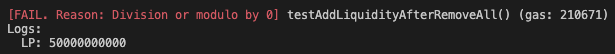

참고: 같은 이유로 문제가 생기는 것은 같은 번호로 매겼습니다.<br><br>

# choiyounghyeon

## 1. addLiquidity 비율 체크 안함

### 설명

function addLiquidity  
Line 47 ~ 64  

addLiquidity 함수로 X 토큰만 대량으로, Y 토큰은 극소량 넣고, removeLiquidity를 실행하면 Y 토큰 자금 탈취가 가능하다.  
<picture>
    
    
</picture>
토큰 사이의 비율을 체크하지 않기 때문에 풀 비율을 의도적으로 깨뜨리는 조작도 가능하다.  

### 파급력 (High)

Y 토큰의 대부분을 탈취 가능한 큰 파급력을 가지고 있다.

### 해결방안

풀 비율과 다른 input이 들어왔을 때 revert를 시키거나 풀 비율과 같은 선에서 최대한을 사용할 수 있도록 계산을 하여 계산을 하여 돌려주는 형식이 필요하다. 

## 2. 1000 이하의 token swap Underflow

### 설명

function swap  
Line 26 - uint256 x_value = tokenXAmount / 1000 * 999;  
Line 36 - uint256 y_value = tokenYAmount / 1000 * 999;  
tokenXAmount 또는 tokenYAmount가 1000보다 작으면 outputAmount가 0이 되어 DEX의 swap이 작동되지 않는다.  
<picture>
    
    
</picture>

### 파급력 (Informational)

Decimal이 18일 때 10^-15 이하의 토큰의 개수가 매우 적은 상황에서의 swap은 잘 일어나지 않으므로 파급력이 낮은 편이다.

### 해결방안

곱셈을 먼저하도록 연산 순서를 바꾼다.
```
uint256 x_value = tokenXAmount * 999 / 1000;
uint256 y_value = tokenYAmount * 999 / 1000;
```

# huhsiwon

## 3. LP 토큰이 다 burn된 이후에 유동성 공급

### 설명

function addLiquidity  
Line 36  
removeLiquidity 함수로 모든 LP를 뺀 이후에 다시 addLiquidity를 호출하면 totalSupply가 0이기 때문에 풀을 사용할 수 없게 된다.
<picture>
    
    
</picture>

### 파급력 (Medium)

피해를 보는 사람은 없지만 LP를 다 뺀 이후에 사용할 수 없는 코드로 컨트랙트 자체가 작동할 수 없다. 하지만 유동성을 모두 제거한 후 다시 공급하는 일은 일반적으로 발생하지 않으므로 Medium 등급을 매겼다.  

### 해결방안

removeLiquidity 함수 내부에 totalSupply가 0일 때 firstLP를 true로 만들어 주는 부분을 추가하거나 first_LP 변수가 아닌 totalSupply의 값을 체크하도록 변경한다.

## 4. transfer 함수 미구현

### 설명

function transfer  
Line 106  
transfer 기능이 미구현되어 있으므로 LP 토큰을 전송하는 것이 불가능히다.  

### 파급력 (Informational)

LP 토큰을 받은 사람이 토큰을 활용할 수 없다.  

### 해결방안

transfer 함수 구현  

# hwangjoontae

## 5. totalSupply_ 계산

### 설명

function removeLiquidity  
Line 56, 57  
removeLiquidity를 할 때 totalSupply_를 줄여주지 않기 때문에 다음 removeLiquidity를 호출하면 실제 지분보다 적게 인출이 되는 문제가 발생한다.  
<picture>
    
    
</picture>
removeLiquidity를 한 이후에 addLiquidity를 진행하면 발행되야 하는 만큼 LP가 발행되지 않는다.  
<picture>
    
    
</picture>

### 파급력(Low)

유동성을 공급한 사용자가 지분보다 적은 토큰을 돌려받게 된다.  

### 해결방안

removeLiquidity 함수에서도 totalSupply_에서 burn된 토큰 수를 빼주는 코드를 추가한다.
```
totalSupply_ -= LPTokenAmount;
```

## 3. LP 토큰이 다 burn된 이후에 유동성 공급

### 설명

function addLiquidity  
Line 34~42
removeLiquidity 함수로 모든 LP를 뺀 이후에 다시 addLiquidity를 호출하면 amountX와 amountY가 0이기 때문에 풀을 사용할 수 없게 된다. 3번과 마찬가지의 오류가 발생한다.  

### 파급력(Medium)

피해를 보는 사람은 없지만 LP를 다 뺀 이후에 사용할 수 없는 코드로 컨트랙트 자체가 작동할 수 없다. 하지만 유동성을 모두 제거한 후 다시 공급하는 일은 일반적으로 발생하지 않으므로 Medium 등급을 매겼다.  

### 해결방안

4번과 마찬가지로 removeLiquidity 함수에서도 totalSupply_를 빼주는 부분을 만든다.

# imnara

## 1. addLiquidity 비율 체크 안함

### 설명

function addLiquidity  
Line 75~107  
addLiquidity 함수로 X 토큰만 대량으로, Y 토큰은 극소량 넣고, removeLiquidity를 실행하면 Y 토큰 자금 탈취가 가능하다.  
토큰 사이의 비율을 체크하지 않기 때문에 풀 비율을 의도적으로 깨뜨리는 조작도 가능하다.  

### 파급력 (High)

Y 토큰의 대부분을 탈취 가능한 큰 파급력을 가지고 있다.  

### 해결방안

풀 비율과 다른 input이 들어왔을 때 revert를 시키거나 풀 비율과 같은 선에서 최대한을 사용할 수 있도록 계산을 하여 계산을 하여 돌려주는 형식이 필요하다.  

## 4. transfer 함수 미구현

### 설명

function transfer  
Line 138~139  
transfer 기능이 미구현되어 있으므로 LP 토큰을 전송하는 것이 불가능히다.  

### 파급력 (Informational)

LP 토큰을 받은 사람이 토큰을 활용할 수 없다.  

### 해결방안

transfer 함수 구현  

# kimhanki

## 6. transfer 함수로 자금 탈취

### 설명

function transfer  
Line 159~166  
transfer 함수가 external로 구현되어 있으므로 아무나 lp 토큰을 발행할 수 있다.  
<picture>
    
    
</picture>

### 파급력(Critical)

전체 lp 개수보다 훨씬 많이 발행하여 removeLiquidity를 실행하면 Dex 내부에 있는 모든 자금을 탈취할 수 있다.

### 해결방안

transfer 함수를 internal로 바꾸거나 기능을 addLiquidity 안으로 넣는다.

## 7. Oracle Price Setting Underflow

### 설명

function addLiquidity  
Line 81~84  
처음 공급되는 tokenXAmount, tokenYAmount가 1 ether 이하의 개수라면, price가 0이 되어 LP를 받을 수 없고, 이후 1 ether 이상의 토큰을 공급한 사람이 모든 지분을 가져가게 된다.  
<picture>
    
    
</picture>

### 파급력 (Low)

1 ether 이하의 개수를 공급한 사람은 지분을 가지지 못한다. 개인이 손해를 보게 된다.  

### 해결방안

setPrice 함수를 호출할 때 decimals로 나누는 부분을 없앤다.  

# kimnamryeong

## 8. addLiquidity function Underflow

### 설명

function _quote  
Line 168~171  
_quote 함수에서 _reserveA가 _inputAmountA * _reserveB보다 훨씬 큰 상황이라면 underflow가 발생하여 한 쪽 토큰만 일부 가져가게 된다.  
<picture>
    
    
</picture>

### 파급력 (Informational)

극한으로 적은 양의 token을 공급하는 경우는 잘 없기 때문에 크게 문제가 되지 않는다.

### 해결방안

가져올 토큰 개수가 0인지 확인한다.  

# kimyoungwoon

## 9. LP 토큰 개수와 가치의 차이

### 설명

function addLiquidity  
Line 78~79  
풀 비율과 관계없이 넣는 토큰을 모두 받아오기 때문에 풀 비율도 깨지고, 사용자가 넣은 가치보다 적은 수량의 LP를 받게 된다.  
<picture>
    
    
</picture>

### 파급력 (Low)

사용자가 받는 토큰의 개수가 실제 넣은 가치보다 적어진다.  

### 해결방안

실제로 필요한 개수만큼만 계산해서 가져갈 수 있도록 한다.  

# kimziwoo

## 9. LP 토큰 개수와 가치의 차이

### 설명

function addLiquidity  
Line 124~125  
풀 비율과 관계없이 넣는 토큰을 모두 받아오기 때문에 풀 비율도 깨지고, 사용자가 넣은 가치보다 적은 수량의 LP를 받게 된다.  

### 파급력 (Low)

사용자가 받는 토큰의 개수가 실제 넣은 가치보다 적어진다.  

### 해결방안

실제로 필요한 개수만큼만 계산해서 가져갈 수 있도록 한다.  

# koominjae

## 9. LP 토큰 개수와 가치의 차이

### 설명

function addLiquidity  
Line 40~41  
풀 비율과 관계없이 넣는 토큰을 모두 받아오기 때문에 풀 비율도 깨지고, 사용자가 넣은 가치보다 적은 수량의 LP를 받게 된다.  

### 파급력 (Low)

사용자가 받는 토큰의 개수가 실제 넣은 가치보다 적어진다.  

### 해결방안

실제로 필요한 개수만큼만 계산해서 가져갈 수 있도록 한다.  

## 8. addLiquidity function Underflow

### 설명

function addLiquidity  
Line 31  
(tokenXAmount + reserveX) * (tokenYAmount + reserveY)가 MAXMIMUM_LIQUIDITY보다 작으면 토큰을 가져가도 LP 토큰이 발행되지 않는다.

### 파급력 (Informational)

극한으로 적은 양의 token을 공급하는 경우는 잘 없기 때문에 크게 문제가 되지 않는다.

### 해결방안

발행할 토큰 개수가 0인지 확인한다.  

## 6. transfer 함수로 자금 탈취

### 설명

function transfer  
Line 105~108  
transfer 함수가 public으로 구현되어 있으므로 아무나 lp 토큰을 발행할 수 있다.  

### 파급력(Critical)

전체 lp 개수보다 훨씬 많이 발행하여 removeLiquidity를 실행하면 Dex 내부에 있는 모든 자금을 탈취할 수 있다.  

### 해결방안

transfer 함수를 internal로 바꾸거나 기능을 addLiquidity 안으로 넣는다.  

# kwonjoonwo

## 10. RemoveLiquidity 실행 불가능

### 설명

addLiquidity와 removeLiquidity는 balances의 잔고를 바탕으로 산출하지만 swap은 balanceOf를 통해 구하기 때문에 swap이 되고나면 removeLiquidity를 실행했을 때 인출이 불가능해지는 경우가 있다.  
<picture>
    
    
</picture>

### 파급력 (Low)

### 해결방안

balances 기반으로 관리하지 않거나, swap을 할 때마다 balances를 업데이트해야 한다.

## 9. LP 토큰 개수와 가치의 차이

### 설명

function addLiquidity  
Line 66~67  
풀 비율과 관계없이 넣는 토큰을 모두 받아오기 때문에 풀 비율도 깨지고, 사용자가 넣은 가치보다 적은 수량의 LP를 받게 된다.  

### 파급력 (Low)

사용자가 받는 토큰의 개수가 실제 넣은 가치보다 적어진다.  

### 해결방안

실제로 필요한 개수만큼만 계산해서 가져갈 수 있도록 한다.  

## 4. transfer 함수 미구현

### 설명

function transfer  
Line 86~87  
transfer 기능이 미구현되어 있으므로 LP 토큰을 전송하는 것이 불가능히다.  

### 파급력 (Informational)

LP 토큰을 받은 사람이 토큰을 활용할 수 없다.  

### 해결방안

transfer 함수 구현  

# leeseonghwi

## 11. AddLiquidity 지분 잘못 구현으로 인한 자금 탈취 가능

### 설명

function addLiquidity  
Line 128~130, 137~139  
```
reward = (sqrt((reservedX * reservedY) / (curX * curY)) - 1) * reward;
reward = (sqrt((reservedX * reservedY) / (curX * curY)) - 1) * reward;
```
LP 개수를 계산하는 식 구현이 잘못되어 있어 틀린 만큼의 LP 토큰 양이 리턴된다. 현재 가지고 있는 양이 아닌 이전에 입금된 양에 비례해서 계산되기 때문에 틀린 결과가 나왔다.  
<picture>
    
    
</picture>

### 파급력 (Critical)
많은 금액의 addLiquidity가 일어난 직후 적은 금액을 addLiquidity하여 removeLiquidity를 호출하면 대부분의 자금이 탈취 가능하다.  

### 해결방안

아래와 같이 이전 입금 양이 아닌 전체 양으로 수정한다.  
reward = (sqrt((reservedX * reservedY) / (curX * curY)) - 1) * totalReward;  

## 4. transfer 함수 미구현

### 설명

function transfer  
Line 185  
transfer 기능이 미구현되어 있으므로 LP 토큰을 전송하는 것이 불가능히다.  

### 파급력 (Informational)

LP 토큰을 다른 사람에게 전달할 수 없어 활용이 불가능하다.  

### 해결방안

transfer 함수 구현  

# moonsunghoon

# seojoonwon

## 1. addLiquidity 비율 체크 안함

### 설명

function addLiquidity  
Line 66  
addLiquidity 함수로 X 토큰만 대량으로, Y 토큰은 극소량 넣고, removeLiquidity를 실행하면 Y 토큰 자금 탈취가 가능하다.  
토큰 사이의 비율을 체크하지 않기 때문에 풀 비율을 의도적으로 깨뜨리는 조작도 가능하다.  

### 파급력 (High)

Y 토큰의 대부분을 탈취 가능한 큰 파급력을 가지고 있다.

### 해결방안

풀 비율과 다른 input이 들어왔을 때 revert를 시키거나 풀 비율과 같은 선에서 최대한을 사용할 수 있도록 계산을 하여 계산을 하여 돌려주는 형식이 필요하다. 

## 12. 잔고가 있음에도 swap이 되지 않음

### 설명

function swap  
Line 102~103  
Swap의 fee가 token 잔고를 넘어가게 되면 swap이 되지 않는다.  
<picture>
    
    
</picture>

### 파급력 (High)

스마트 컨트랙트가 고장나 swap 기능을 실행할 수 없게 된다.

### 해결방안

removeLiquidity과 swap을 할 때 fee 또한 업데이트 해준다.  