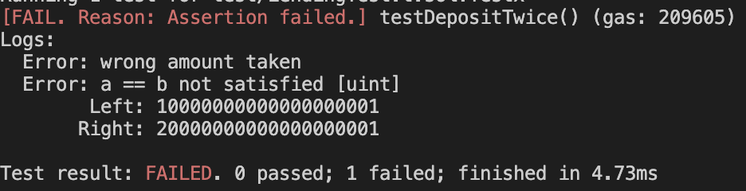
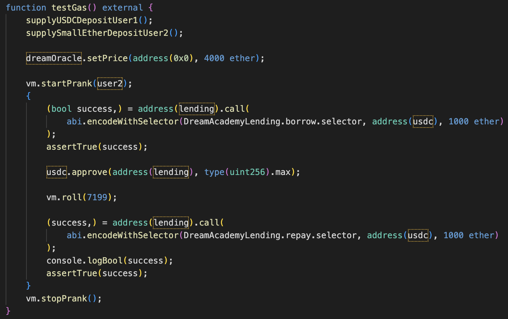

참고: 같은 이유로 문제가 생기는 것은 같은 번호로 매겼습니다.<br><br>

# choiyounghyeon

## 미구현(test 미통과 4/28)

### 설명

deposit 외에 구현된 것이 없음  

# huhsiwon

## 미구현(test 미통과 27/28)

### 설명

중간에 USDC를 deposit하는 경우 계산이 틀리게 된다.   

## 1. 이자율 계산 틀림

### 설명

block이 500 단위 일때만 계산이 맞고, 500 이상이 되면 500 단위 이하에서 오차가 발생하고, 500 미만은 단리 이자로 복리를 계산했기 때문에 오차가 발생한다.  

### 파급력 (Low)

이자가 더 낮게 쌓이기 때문에 유저가 손해를 본다.  

### 해결방안

1 block 단위의 이자를 계산해서 전체 이자 계산을 한다.  

## 2. usdc 가격 오르면 문제 발생

### 설명

function UnHealthyLoan  
Line 105  
```
uint256 user_collateral = map_user_deposit_token_amount[user][eth_address] * eth_price / (10**18);
```
usdc의 가격이 10 ** 18일 것으로 고정하여 계산이 되었다.  
<picture>
    
</picture>
<picture>
    
</picture>

### 파급력 (Medium)

Liquidate가 적절한 시기에 나지 않아 전체적인 손해가 날 수 있다. USDC 가격이 급변하는 사건이 잘 일어나지는 않지만 한 번 발생하면 피해가 커진다.  

### 해결방안

```
uint256 user_collateral = map_user_deposit_token_amount[user][eth_address] * eth_price / usdc_price;
```

# imnara

## 미구현(test 미통과 24/28)

### 설명

이자 계산을 하는 부분이 없다.  

## 3. liquidate 조건 잘못 구현

### 설명

function liquidate  
Line 88  
100 ether 이하일 때 전체를 liquidate해야 하는데 100으로 적용되어있다.  
```
require(_borrow[user] < 100 || amount == (_borrow[user] * 25 / 100), "");
```

### 파급력 (Informational)

크게 문제가 되지는 않지만 문제 조건에는 안 맞는다.  

### 해결방안

```
require(_borrow[user] < 100 ether || amount == (_borrow[user] * 25 / 100), "");
```

# kimhanki

## 미구현 및 잘못 구현(test 미통과 14/28)

### 설명

liquidate, withdraw, getAccruedSupplyAmount 함수 미구현  
repay는 tokenAddress가 usdc일 때만 발생한다.  

## 2. usdc 가격 오르면 문제 발생

### 설명

function borrow  
Line 64  
```
require(oracle.getPrice(address(0)) / 10 ** 18 * etherDepositAmounts[msg.sender] * 50 / 100 - borrowAmounts[msg.sender][tokenAddress] >= amount, "Insufficient Collaterals");
```
USDC 가격이 1이라는 전제를 가지고 만들어진 코드이다. 가격이 1에서 벗어나게 되면 빌려주는 USDC의 가치를 잘못 잡게 된다. Usdc가 2배 이상 오른다면 담보물보다 더 큰 가치의 USDC를 빌려줄 수도 있다.  

### 파급력 (Medium)

USDC 가격이 급변하는 사건이 잘 일어나지는 않지만 한 번 발생하면 피해가 커진다.  

### 해결방안

1e18이 아닌 priceOracle.getPrice(tokenAddress)으로 나눠서 문제를 막는다.  

# kimnamryeong

## 미구현(test 미통과 23/28)

### 설명

전체 이자 계산은 되고 있지만 개인별 이자 계산이 잘못되었다.  

## 2. usdc 가격 오르면 문제 발생

### 설명

function withdraw  
Line 138  
```
vaults[msg.sender].availableBorrowETH2USDC = vaults[msg.sender].collateralETH * oracle.getPrice(address(0x0)) * LTV / (100*1e18);
```
USDC 가격이 1이라는 전제를 가지고 만들어진 코드이다. 가격이 1에서 벗어나게 되면 빌려주는 USDC의 가치를 잘못 잡게 된다. Usdc가 2배 이상 오른다면 담보물보다 더 큰 가치의 USDC를 빌려줄 수도 있다.  
<picture>
    
</picture>
<picture>
    
</picture>

### 파급력 (Medium)

USDC 가격이 급변하는 사건이 잘 일어나지는 않지만 한 번 발생하면 피해가 커진다.  

### 해결방안

1e18이 아닌 priceOracle.getPrice(usdc)으로 나눠서 문제를 막는다.  
```
vaults[msg.sender].availableBorrowETH2USDC = vaults[msg.sender].collateralETH * oracle.getPrice(address(0x0)) * LTV / 100 / oracle.getPrice(address(token));
```

# kimyoungwoon

## 2. usdc 가격 오르면 문제 발생

### 설명

function _getMaxBorrowAmount, _getMaxBorrowCurrentDebtCheck  
Line 161~164  
```
function _getMaxBorrowAmount(uint256 collateral) internal view returns (uint256) {
    uint256 colateralValueInUsdc = (collateral.mul(priceOracle.getPrice(address(0)))).div(1e18);
    return (colateralValueInUsdc * LTV) / 100;
}
```
```
function _getMaxBorrowCurrentDebtCheck(address user) internal view returns (uint256) {
        uint256 ethCollateral = userBalances[user].collateral;
        uint256 collateralValueInUsdc = (ethCollateral.mul(priceOracle.getPrice(address(0)))).div(1e18);
        ...
}
```
USDC 가격이 1이라는 전제를 가지고 만들어진 코드이다. 가격이 1에서 벗어나게 되면 빌려주는 USDC의 가치를 잘못 잡게 된다. Usdc가 2배 이상 오른다면 담보물보다 더 큰 가치의 USDC를 빌려줄 수도 있다.  
<picture>
    
</picture>
<picture>
    
</picture>

### 파급력 (Medium)

USDC 가격이 급변하는 사건이 잘 일어나지는 않지만 한 번 발생하면 피해가 커진다.  

### 해결방안

1e18이 아닌 priceOracle.getPrice(usdc)으로 나눠서 문제를 막는다.  

## 4. withdraw underflow

### 설명

function withdraw  
Line 148  
```
amount = getAccruedSupplyAmount(tokenAddress) / WAD * WAD;
```
WAD로 나누기 때문에 1e18보다 작은 amount는 0이 되어버려 인출이 불가능해진다.  
<picture>
    
</picture>
<picture>
    
</picture>

### 파급력 (Low)

사용자의 USDC 토큰이 Lending이 컨트랙트 내부에 묶여버린다.  

### 해결방안

WAD로 나누지 않으면 된다.  
```
amount = getAccruedSupplyAmount(tokenAddress);
```

# kimziwoo

## 미구현(test 미통과 26/28)

### 설명

정확한 이율이 나오지 않아 2개의 테스트 케이스를 통과하지 못하였다.  

## 5. withdraw 중복 가능

### 설명

function withdraw  
Line 149~158  
withdraw한 금액이 전체 금액에만 반영되기 때문에 다시 withdraw를 해도 막는 장치가 없다.  
<picture>
    
</picture>
<picture>
    
</picture>

### 파급력 (Critical)

적은 양의 usdc로도 모든 자금을 탈취할 수 있다.  

### 해결방안

_deposits을 업데이트 해준다.  

# koominjae

## 미구현 및 잘못 구현(test 미통과 19/28)

### 설명

시간이 많이 지나면 getInterest에서 decimal로 나눠주는 부분이 충분하지 않기 때문에 너무 큰 숫자가 나오게 된다. 그래서 withdraw 함수가 모두 실패하는 것으로 보인다.  
getAccruedSupplyAmount 함수 미구현  

## 2. usdc 가격 오르면 문제 발생

### 설명

function getBorrowLTV  
Line 118  
function getUserLTV   
Line 124  
```
uint256 ethValue = (amount * dreamoracle.getPrice(address(0))) / DECIMAL;
```
```
uint256 CollateralusdcValue = (ethCollateral * dreamoracle.getPrice(address(0))) / DECIMAL;
```
usdc의 가격이 10 ** 18일 것으로 고정하여 계산이 되었다.  

### 파급력 (Medium)

Liquidate가 적절한 시기에 나지 않아 전체적인 손해가 날 수 있다. USDC 가격이 급변하는 사건이 잘 일어나지는 않지만 한 번 발생하면 피해가 커진다.  

### 해결방안

DECIMAL이 아니라 dreamoracle.getPrice(address(usdc))로 교체한다.

# kwonjoonwoo

## 미구현(test 미통과 11/28)

### 설명

borrow, repay, liquidate, getAccruedSupplyAmount 미구현

# leeseonghwi

## 미구현 및 잘못 구현(test 미통과 25/28)

### 설명

getReserve() 함수가 호출될 때 ether와 usdc의 가치를 동시에 가지고 오고, USDC뿐만 아니라 ether에도 이자가 붙고 있다.  
liquidate 함수가 구현되지 않았다.  

## 6. Deposit되는 금액 틀림

### 설명

function deposit  
Line 84~88  
```
usdc.transferFrom(
    msg.sender,
    address(this),
    _reserve[msg.sender][tokenAddress]
);
```
<picture>
    
</picture>
<picture>
    
</picture>

### 파급력 (Low)

유저가 원하지 않은 금액의 크기를 넣게 되고, 추후 withdraw할 수 없는 금액이 된다.  

### 해결방안

_reserve[msg.sender][tokenAddress]가 아닌 amount를 가져온다.  
```
usdc.transferFrom(
    msg.sender,
    address(this),
    amount
);
```

## 1. 이자율 계산 틀림

### 설명

block이 500 단위 일때만 계산이 맞고, 500 이상이 되면 500 단위 이하에서 오차가 발생하고, 500 미만은 단리 이자로 복리를 계산했기 때문에 오차가 발생한다.  

### 파급력 (Low)

이자가 더 낮게 쌓이기 때문에 유저가 손해를 본다.  

### 해결방안

1 block 단위의 이자를 계산해서 전체 이자 계산을 한다.  

## 5. withdraw 중복 가능

### 설명

function withdraw  
Line 149~158  
withdraw한 금액이 전체 금액에만 반영되기 때문에 다시 withdraw를 해도 막는 장치가 없다.  
<picture>
    
</picture>
<picture>
    
</picture>

### 파급력 (Critical)

적은 양의 usdc로도 모든 자금을 탈취할 수 있다.  

### 해결방안

_deposits을 업데이트 해준다.  

# moonsunghoon

## 미구현(test 미통과 24/28)

## 7. allowance 체크

### 설명

function deposit  
Line 85  
```
require(tokenUSDC.allowance(msg.sender, address(this)) > amount);
```
allowance와 amount가 일치해도 transaction이 일어나야 한다.  

### 파급력 (informational)

현재 allowance에 1만 추가해서 실행해도 가능하므로 심한 문제는 아니다.  

### 해결방안

등호를 추가한다.  
```
require(tokenUSDC.allowance(msg.sender, address(this)) >= amount);
```

## 8. Interest Integer Underflow

### 설명

function _updateInterest  
Line 267  
```
uint256 result = (book.usdc_deposit / 1e18 * RAY) + (prime_interest - (prime * RAY / 1e18)) * book.usdc_deposit / (USDCBalance + USDCtotalBorrow) ;   // 지분율
```
function calculateInterest  
Line 292~293  
```
uint256 _borrowAmount = borrowAmount / 1e18;  // 보정
uint256 interest = mul(_borrowAmount, rpow(1001 * RAY / 1000, blockPeriodDays));
```
book.usdc_deposit와 borrowAmount를 1e18으로 나누기 때문에 1 ether 이하는 무시되어 계산이 틀리게 된다.  

### 파급력 (Informational)

1 usdc 이하의 적은 금액에서 발생하는 문제이기 때문에 파급력이 거의 없다.  

### 해결방안

곱셈을 먼저 하여 underflow가 되지 않도록 한다.  
```
uint256 result = (book.usdc_deposit * RAY / 1e18) + (prime_interest - (prime * RAY / 1e18)) * book.usdc_deposit / (USDCBalance + USDCtotalBorrow) ;   // 지분율
```

# seojoonwon

## 9. liquidate 함수 일관성

### 설명

function liquidate  
Line 237  
Liquidate 대상의 금액이 100 ether 이상이면 Liquidate를 하는 사람에게서 usdc만 가져가고 ether를 주지 않는다.  

### 파급력 (Low)

Liquidate를 할 유인이 사라지므로 liquidate가 발생하지 않아 작동에 문제가 발생할 수도 있다.  

### 해결방안

아래 코드를 237줄에 추가한다.
```
(bool success, ) = msg.sender.call{value: amount}("");
```

## 10. for문으로 인한 높은 가스비

### 설명

modifier setInterest  
Line 86~110  
```
modifier setInterest {
        ...
        for(uint i = 0; i< customers_address.length; i++){
            ...
            if(customer[c].borrow_usdc > 0){
                ...
                for(uint j = 0; j < day; j++){
                    tmp = tmp + tmp / 1000;
                }
                for(uint j = 0; j < blocks; j++){
                    tmp = tmp + tmp / digit * interest_per_sec;
                }
                ...
            }
        }
        for(uint i = 0; i < customers_address.length; i++){
            ...
        }
        _;
    }
```
시간과 유저 수에 따라 for문이 이중으로 있어, 실행 횟수가 급격하게 증가하기 때문에 가스비 이슈가 존재한다. 유저가 2명이고 {deposit(ether, usdc), borrow, 7199 block 지남, repay}와 같이 간단한 함수만 진행했음에도 가스비가 4335404만큼 나왔다. repay를 제외하고 코드를 실행하면 가스비가 397342만큼 나오기 때문에 repay 함수 하나가 거의 4M만큼 사용된다.  
<picture>
    
</picture>
<picture>
    
</picture>

### 파급력 (Informational)

유저가 가스비에 부담을 느끼게 되고, 충분한 가스비를 주지 않는다면 revert가 날 가능성이 높아진다. 유저 숫자와 지난 시간(days와 days로 나눈 나머지의 blocks 숫자)에 비례하여 증가한다.  

### 해결방안

소수의 power를 계산할 수 있는 DS Math 등의 라이브러리를 사용하여 for문을 최소화 한다.  